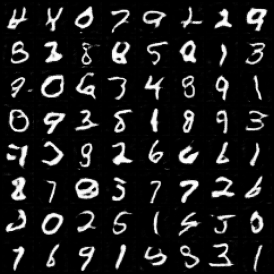
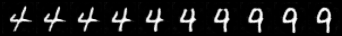

# 情報学ゼミ課題チームB

## DCGANの選定理由

本プロジェクトでは、 DCGAN (Deep Convolutional Generative Adversarial Networks)を採用した。
DCGAN は畳み込み構造を用いた画像生成モデルであり、MNIST のような低解像度かつ単純な画像データに対しても安定した学習と生成が可能である。
また、潜在変数を連続的なベクトルとして扱うため、線形補間による潜在空間の操作が容易であり、数字間の形状変化を段階的に観察できる。
このような特徴は、課題 2 で求められている「4 から 9 への変化」を視覚的に確認する上で有効であると考え、本モデルを選定した。

## モデル構造： データセット

本実装では、PyTorch が提供する MNIST データセットを用いて学習を行った。
データ読み込みは get_mnist_dataloader() 関数内で行い、画像に対して前処理を施した上で DataLoader によりミニバッチ化している。
前処理として、まず MNIST の元画像（28 $\times$ 28）を $32 \times 32$ にリサイズした。これは DCGAN の Generator が 4 $\rightarrow$ 8 $\rightarrow$ 16 $\rightarrow$ 32と段階的にアップサンプリングする構造を持つため、画像サイズを 2 の累乗に揃えることでモデル構造を単純化する目的がある。
その後、画像を Tensor に変換し、画素値を[-1, 1] の範囲に正規化した。この正規化は、Generator の出力層で tanh 関数を使用しているため、実画像と生成画像の分布を一致させ、学習を安定させるためである。

## モデル構造: Generator (生成器)

本プロジェクトの Generator は、**DCGAN (Deep Convolutional GAN)** のアーキテクチャを採用しており、100次元の乱数（ノイズ）を入力として、32x32ピクセルの手書き数字画像を生成している。


### アーキテクチャ概要
Generatorは、**転置畳み込み (Transposed Convolution)** を用いて、特徴マップのサイズを段階的に拡大（アップサンプリング）していく構造になっている。

1.  **入力**: 100次元の潜在変数 $z$ (正規分布ノイズ)
2.  **層の構成**: 全4層のアップサンプリング
    -   入力 $\rightarrow$ $4 \times 4$
    -   $4 \times 4$ $\rightarrow$ $8 \times 8$
    -   $8 \times 8$ $\rightarrow$ $16 \times 16$
    -   $16 \times 16$ $\rightarrow$ $32 \times 32$ (出力画像)
3.  **出力**: $1 \times 32 \times 32$ のグレースケール画像 (値の範囲は $[-1, 1]$)

### 実装のポイント
-   **ConvTranspose2d (逆畳み込み)**:
    通常の畳み込み（画像サイズを小さくする）とは逆に、画像サイズを倍々に拡大しながら特徴を学習している。
-   **Batch Normalization**:
    各層の出力の分布を整えることで、学習を安定させ、勾配消失や初期値依存の問題を軽減している。
-   **活性化関数**:
    -   中間層: **ReLU** (Rectified Linear Unit) を使用し、スパースな表現を学習させている。
    -   出力層: **Tanh** (Hyperbolic Tangent) を使用。これは、Discriminatorへの入力画像が `[-1, 1]` に正規化されているため、出力範囲を合わせるために必須である。

### なぜ 32x32 なのか？
MNISTの元データは $28 \times 28$ ですが、本モデルでは $32 \times 32$ にリサイズして扱っている。
これは、CNNの構造上、サイズを $2$ の累乗 $(4 \to 8 \to 16 \to 32)$ で変化させる方が、パディング計算が容易でモデル構造がシンプルになるため。

## モデル構造: Discriminator (識別器)

本プロジェクトの Discriminator は、**DCGAN (Deep Convolutional GAN)** のアーキテクチャを採用しており、32x32ピクセルの画像を入力として、それが本物のデータかGeneratorによって生成された偽物かを識別・判定する二値分類モデルである。

### アーキテクチャ概要
Discriminatorは、**畳み込み (Convolution)** を用いて、特徴マップのサイズを段階的に縮小（ダウンサンプリング）していく構造になっている。

1.  **入力**: 32x32のグレースケール画像
2.  **層の構成**: 全4層のダウンサンプリング
    -   入力 $\rightarrow$ $16 \times 16$
    -   $16 \times 16$ $\rightarrow$ $8 \times 8$
    -   $8 \times 8$ $\rightarrow$ $4 \times 4$
    -   $4 \times 4$ $\rightarrow$ $1 \times 1$ 
3.  **出力**: Sigmoid関数による画像が本物である確率 (値の範囲は $[0, 1]$)

### 実装のポイント
-   **Strided Convolutions（ストライド付き畳み込み）**:
    Max Poolingなどのプーリング層を使用せず、畳み込み層のパラメータによって画像サイズを半分ずつ圧縮している。これによりネットワーク自身が空間的なダウンサンプリングの方法を学習できる。
-   **LeakyReLU**:
    活性化関数には通常のReLUではなく、負の領域でもわずかに勾配を持つ LeakyReLU を用いている。これにより勾配消失を防ぎ、学習を安定させている。
    **Label Smoothing(ラベル平滑化)**:
    本物画像の正解ラベルとして 1.0 ではなく 0.9 を使用した。これにより、Discriminatorが過剰に学習（過学習）してGeneratorへの勾配が消失するのを防ぎ、学習の安定化を図っている。

### 学習の設定

本プロジェクトでは、GAN特有の学習の不安定さを解消し、高品質な画像を生成するために以下の設定を採用した。

1. **最適化手法の設定**  
   Generator および Discriminator の最適化には Adam を使用した。  
   学習率は 0.0002 とし、モーメント係数は 
   $(($beta_1, $beta_2) = (0.5, 0.999)\)$ に設定した。  
   これは、$($beta_1)$ をデフォルト値より小さくすることで、
   学習中の急激な更新を抑え、両ネットワークのバランスを保つためである。

2. **損失関数の選択**  
   本タスクは、本物画像と生成画像を判別する二値分類問題である。  
   そのため、バイナリ・クロスエントロピー誤差
   （Binary Cross Entropy Loss）を損失関数として採用した。

3. **学習安定化の工夫**  
   学習を安定させるために、ラベル平滑化と重みの初期化を行った。  
   ラベル平滑化では、本物画像の正解ラベルを 1.0 ではなく 0.9 とした。  
   これにより、Discriminator の過学習を防ぎ、
   Generator の学習停滞を抑制している。  
   また、重みは平均 0、標準偏差 0.02 の正規分布で初期化した。

4. **学習規模の設定**  
   バッチサイズは 128、エポック数は 20 とした。  
   計算は GPU（CUDA）を使用して行い、
   学習時間の短縮と効率化を図った。


## モーフィング生成
morphing.pyは、学習済みのGeneratorを利用して、ある数字から別の数字へと滑らかに変化していく様子を画像として生成するものである。

### モーフィング生成の概要
1. **準備**:  
   学習済みのモデル(generator_final.pth)を読み込み、ランダムなノイズから生成された64の数字で構成されたグリッド画像を生成する。
2. **選択**:  
   ユーザーが変化させたい数字の始点と終点の画像をインデックス番号で指定する。
3. **補完**:  
   始点と終点のノイズの間を数段階 (steps=10) に分けて、中間のノイズを計算する。
4. **生成**:  
   計算した中間のノイズを学習済みのGeneratorに通し、徐々に形が変わっていく連続画像を生成・保存する。

### アルゴリズムの利点
  通常、2つの画像を移り変わらせる方法として、単に不透明度を調整して切り替えるクロスフェードがあるが、それでは中間の画像は二つの数字が重なった状態になり、不自然でぼやけた画像になってしまう。\
  今回用いた方法では計算されたノイズに基づいて中間にあるべき形を生成するため、線が徐々につながったり、穴がふさがったりといった自然な形状変化を生成することができる。

## 実行手順 (Usage)

本プロジェクトは、以下の手順で実行します。ターミナル（コマンドプロンプト）を使用してください。

### 1. 環境構築 (Installation)
必要なライブラリをインストールする。
```bash
pip install -r requirements.txt
```

2. 学習の実行 (Training)
DCGANの学習を開始します。MNISTデータセットは自動的にダウンロードされる。

```Bash
python dcgan.py
```

実行内容:

デフォルトで 20エポック の学習を行う。

dcgan_output/ フォルダが自動生成され、以下のデータが保存される。

images/: エポックごとの生成画像（epoch_1.png 〜 epoch_20.png）

models/: 学習済みモデル（generator_final.pth）

graphs/: 損失の推移グラフ（loss_graph.png）

3. モーフィング画像の生成 (Morphing)
学習完了後、保存されたモデルを使用して「4」から「9」への変化などを生成する。

```Bash
python morphing.py
```
**操作フロー:**

1.  コマンドを実行すると、まず **参照用グリッド画像** が生成される。
    * 保存先: `dcgan_output/images/morphing_reference_grid.png`
2.  この画像を開き、変化させたい数字（スタート地点とゴール地点）のインデックス（0〜63）を確認。
3.  ターミナルに入力を求められるので、数値を入力して Enter を押す。
    -  左上が0、右下が63

    ```text
    開始する画像のインデックス : 59  <-- 例: "4"の場所を入力
    終了する画像のインデックス : 29  <-- 例: "9"の場所を入力
    ```

4.  指定した2つの数字の間を滑らかに変化させた画像が保存される。
    * 保存先: `dcgan_output/images/morphing_59_to_29.png`
    *(※ ファイル名の数字部分は、入力したインデックスに対応している)*

### ディレクトリ構成
プログラム実行後、以下のような構成になる。
```
.
├── dcgan.py            # 学習用スクリプト
├── morphing.py         # モーフィング生成用スクリプト
├── data/               # MNISTデータセット（自動生成）
└── dcgan_output/       # 出力フォルダ（自動生成）
    ├── images/         # 生成された画像
    ├── models/         # 学習済みモデル（.pth）
    └── graphs/         # Lossグラフ
```

## 実行結果 (Results)

本プロジェクトによる学習・生成結果の一例。

### 1. 手書き数字の生成 (Task 1)
学習が進むにつれて、ノイズから意味のある数字が形成されます。以下は20エポック学習後の生成画像。
「0」から「9」までの数字が、多様な筆跡で生成されていることが確認できる。


*(Fig 1. Generatorによる生成画像 - Epoch 20)*

### 2. モーフィング生成 (Task 2: 4 $\to$ 9)
潜在空間（Latent Space）上で、「4」を生成する潜在変数 $z_4$ から、「9」を生成する潜在変数 $z_9$ へとベクトルを滑らかに変化（線形補間）させた結果である。

単なる画像のフェードアウト（重ね合わせ）ではなく、**「4」の形状が徐々に変形して「9」になっている**点に注目。これは、Generatorが単に画像を暗記しているのではなく、数字の形状の連続的な変化を学習できていることを示している。


*(Fig 2. 潜在変数の操作による「4」から「9」へのモーフィング)*

**補間式:**
$$z = (1 - \alpha) z_{start} + \alpha z_{end}$$
($\alpha$ を $0.0$ から $1.0$ まで変化させて生成)

## 考察
今回の課題では、DCGANを用いて、潜在変数を線形補間することで「4」から「9」への連続的な変化を生成した。生成されたモーフィング画像を観察すると、各ステップで数字の形状が滑らかに変化しており、GANが潜在空間上で意味のある特徴表現を学習していることが確認できた。
しかし、モーフィングの過程で、一部の中間ステップでは数字の形がやや不明瞭になる部分が見られた。これはいくつかの要因によると考えられる。「4」から「9」への変化では、直線的な部分と曲線的な部分が組み合わさるため、潜在空間の線形補間では両方の特徴を十分に表現できない場合がある。この結果、中間ステップでは数字の輪郭がぼやけたり、一部の線が欠けるように見えたりする。また、GANの学習データや生成器の表現力の偏りも影響する可能性があると考えられる。例えば、訓練データ中の「4」や「9」の形状に偏りがある場合、生成器はその特徴を再現するため、中間のステップでは生成が不安定になりやすい。そのため、潜在空間の線形補間だけでは一部の中間ステップで数字の認識が曖昧になったと考えられる。
今回の結果から、潜在変数空間を操作することで、様々な数字のモーフィングを生成できることが示され、DCGANの有用性を確認できた。今後のモーフィングにおける精度向上の有効な案としては、Conditional GANを導入することが考えられる。数字ラベルなどの条件情報をGeneratorとDiscriminatorに入力することにより、潜在変数を補間する際も「4から9への連続的変化」という条件を明示的に与えられるため、中間ステップでも数字らしい形状を保持しやすくなると期待できる。
